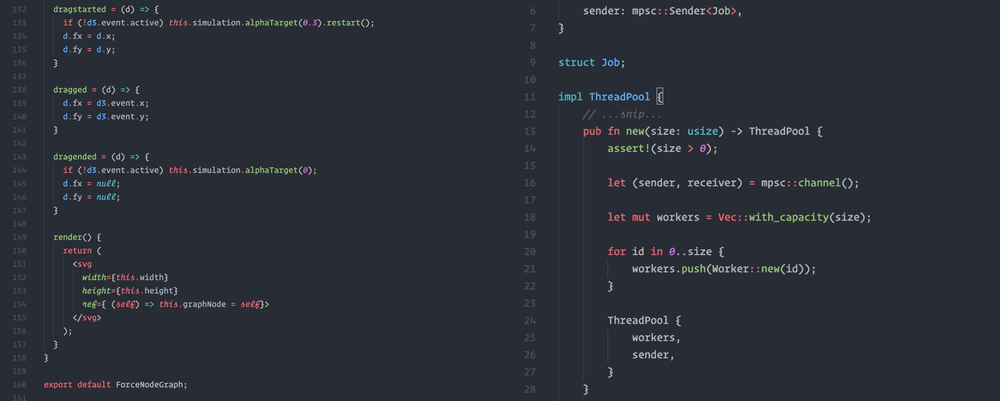

# One Monokai Theme Italic

A cross between Monokai and One Dark theme with added italics
This *italics* fork is based on the theme [*One Monokai*](https://github.com/azemoh/vscode-one-monokai)

## Install

press `ctl/command + shift + p` to launch the command palette then run
```
ext install one-monokai-italics
```

## Screenshot
Screenshot of JavaScript and Rust



## Recommendations
Works best with a coding language with italics support:
I tried with [Hasklig](https://github.com/i-tu/Hasklig) and with OperatorMono.

## Change log
You can take a look at the change log [here](https://github.com/lrecknagel/vscode-one-monokai/blob/master/CHANGELOG.md)
